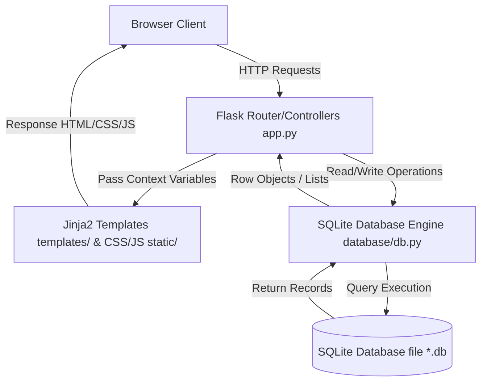

# Project Context: Spendly

This document serves as the permanent context for the **Spendly** project. It outlines the codebase layout, technology stack, database architecture, API routing, coding standards, and roadmap.

---

## 1. Project Overview
**Spendly** is a personal expense tracking web application. Its purpose is to allow users to log their expenses, categorize them, track their monthly spending patterns, and stay on budget without having to use spreadsheets. The application is designed to be highly responsive, modern, and simple to use. Currently, it serves as a step-to-step structured template for developers or students to implement basic database storage, user authentication, and CRUD operations.

---

## 2. Architecture Diagram

The system employs a classic Model-View-Controller (MVC) pattern utilizing Python/Flask:



---

## 3. Folder Structure

Below is the layout of the project directories and files:

```
expense-tracker/
├── .gitignore               # Standard git ignore configuration
├── app.py                   # Main entry point and route controllers
├── file.txt                 # File containing context/steps previously implemented
├── requirements.txt         # Project dependencies list
├── database/                # Database configuration and helper modules
│   ├── __init__.py          # Database package initializer
│   └── db.py                # Database connection, schemas, and seeding (skeleton)
├── static/                  # Static assets served by Flask
│   ├── css/
│   │   └── style.css        # Main stylesheet containing all custom CSS rules
│   └── js/
│       └── main.js          # Main client-side script (placeholder)
└── templates/               # Jinja2 HTML templates
    ├── base.html            # Global base template (Navbar/Footer/Scripts layout)
    ├── landing.html         # Landing/Hero page template (includes video modal)
    ├── login.html           # Login page template
    ├── register.html        # Registration page template
    ├── privacy.html         # Privacy Policy document template
    └── terms.html           # Terms and Conditions document template
```

---

## 4. Tech Stack

- **Backend**: Python 3
- **Framework**: Flask (v3.1.3)
- **Database**: SQLite (SQL Relational engine)
- **Frontend Core**: Vanilla HTML5, Vanilla CSS3 (custom CSS variables design system)
- **Frontend Templating**: Jinja2 (integrated with Flask)
- **Client Scripting**: Vanilla JavaScript (ES6+)
- **Testing**: pytest (v8.3.5), pytest-flask (v1.3.0)

---

## 5. Dependencies

Dependencies are managed in [requirements.txt](file:///D:/claude/claude%20project/expense-tracker/requirements.txt):

- `flask==3.1.3`: The micro web framework.
- `werkzeug==3.1.6`: Underlying WSGI utility library, providing password hashing and validation.
- `pytest==8.3.5`: Testing framework.
- `pytest-flask==1.3.0`: Flask plugin for pytest to run request/client tests.

---

## 6. How to Run the Project

1. **Create and Activate Virtual Environment**:
   ```powershell
   python -m venv venv
   .\venv\Scripts\Activate.ps1   # Windows PowerShell
   ```
2. **Install Dependencies**:
   ```powershell
   pip install -r requirements.txt
   ```
3. **Run Application**:
   ```powershell
   python app.py
   ```
   The application will run locally at `http://127.0.0.1:5001`.

---

## 7. Environment Setup

- **Port**: Default runtime port is configured to `5001` inside [app.py](file:///D:/claude/claude%20project/expense-tracker/app.py).
- **Debug Mode**: Enabled (`debug=True`) for active local reload during development.
- **Database File**: Expected to be initialized as a SQLite database file (e.g. `spendly.db` or configured inside [db.py](file:///D:/claude/claude%20project/expense-tracker/database/db.py)).

---

## 8. Database Design

While currently a skeleton in [db.py](file:///D:/claude/claude%20project/expense-tracker/database/db.py), the standard relational structure for this application contains the following database tables:

### Users Table (`users`)
Stores user accounts for authentication.
| Column | Type | Constraints | Description |
| :--- | :--- | :--- | :--- |
| `id` | INTEGER | PRIMARY KEY AUTOINCREMENT | Unique user ID |
| `name` | TEXT | NOT NULL | User's full name |
| `email` | TEXT | UNIQUE NOT NULL | User's login email |
| `password_hash` | TEXT | NOT NULL | Secure salted password hash |

### Expenses Table (`expenses`)
Stores logged transaction records.
| Column | Type | Constraints | Description |
| :--- | :--- | :--- | :--- |
| `id` | INTEGER | PRIMARY KEY AUTOINCREMENT | Unique expense record ID |
| `user_id` | INTEGER | FOREIGN KEY REFERENCES `users(id)` ON DELETE CASCADE | Associated owner |
| `amount` | REAL | NOT NULL | Monetary spending amount (in INR / ₹) |
| `category` | TEXT | NOT NULL | Expense category (Food, Travel, Bills, etc.) |
| `date` | TEXT | NOT NULL | Log date (YYYY-MM-DD) |
| `description` | TEXT | | Brief note on the transaction |

---

## 9. API Routes

The following HTTP endpoints are registered in [app.py](file:///D:/claude/claude%20project/expense-tracker/app.py):

| Route Path | HTTP Method | Handler Function | Status | Description |
| :--- | :--- | :--- | :--- | :--- |
| `/` | GET | `landing()` | ✅ Completed | Renders the Spendly Landing Page |
| `/register` | GET | `register()` | ⚠️ Incomplete | Renders Registration form |
| `/register` | POST | — | ❌ Missing | Registers new users |
| `/login` | GET | `login()` | ⚠️ Incomplete | Renders Login form |
| `/login` | POST | — | ❌ Missing | Logs user in (sets session) |
| `/logout` | GET | `logout()` | ❌ Placeholder | Destroys active session |
| `/profile` | GET | `profile()` | ❌ Placeholder | Renders profile information |
| `/terms` | GET | `terms()` | ✅ Completed | Renders Terms and Conditions page |
| `/privacy` | GET | `privacy()` | ✅ Completed | Renders Privacy Policy page |
| `/expenses/add` | GET / POST | `add_expense()` | ❌ Placeholder | Log a new expense |
| `/expenses/<int:id>/edit` | GET / POST | `edit_expense(id)` | ❌ Placeholder | Edit an existing expense |
| `/expenses/<int:id>/delete`| POST | `delete_expense(id)`| ❌ Placeholder | Delete an expense |

---

## 10. UI Pages and Components

The interface utilizes a premium, custom CSS design system defined in [style.css](file:///D:/claude/claude%20project/expense-tracker/static/css/style.css):

1. **Global Base Frame ([base.html](file:///D:/claude/claude%20project/expense-tracker/templates/base.html))**:
   - Header Navigation Bar (`.navbar`) including Brand logo, Sign in, and Get started triggers.
   - Global Footer (`.footer`) with logo, legal document links, and copyright info.
2. **Landing Page ([landing.html](file:///D:/claude/claude%20project/expense-tracker/templates/landing.html))**:
   - Hero Section (`.hero`): Styled with clean flex layout, header subtitle, mint green accent badge, and two Call-To-Action buttons.
   - Video Modal Component (`#videoModal`): Embeds a YouTube video using vanilla JavaScript logic configured in [landing.html](file:///D:/claude/claude%20project/expense-tracker/templates/landing.html) to open on click and pause on close.
   - Interactive Preview Card (`.dashboard-preview`): Simulates dashboard metrics (Monthly total, remaining budget progress bars, transactions).
   - Features Grid Section (`.features`): Responsive three-column layout.
3. **Authentication Interface ([login.html](file:///D:/claude/claude%20project/expense-tracker/templates/login.html) & [register.html](file:///D:/claude/claude%20project/expense-tracker/templates/register.html))**:
   - Clean, centered container `.auth-container` with custom `.auth-card` card containers, `.form-input` controls, error boxes, and primary CTA buttons.

---

## 11. Current Features

- **Responsive Landing Page**: Custom premium styling with full responsive rules.
- **Embedded Modal Player**: Video player modal that runs dynamically with vanilla JavaScript to stop video playback upon closing.
- **Static Pages**: Functional Terms and Conditions and Privacy Policy routes.
- **Base templates structure**: Centralized navigation and footer structures.

---

## 12. Missing Features

- **Database Initialization**: Real database connector module implementation.
- **User Sign-up**: Form processing logic for saving users database entries.
- **User Authentication**: Secure password storage, login sessions, profile validation, and sign-out logic.
- **Expense CRUD**: Complete ability to create, read, update, and delete expenses inside the database.
- **Dashboard Data Binding**: Binding real database queries to the dashboard metrics (total expenses, budget progress).

---

## 13. Pending TODOs

As marked in the codebase files:
- [ ] Implement database helpers ([get_db()](file:///D:/claude/claude%20project/expense-tracker/database/db.py#L3), [init_db()](file:///D:/claude/claude%20project/expense-tracker/database/db.py#L4), and [seed_db()](file:///D:/claude/claude%20project/expense-tracker/database/db.py#L5) in [db.py](file:///D:/claude/claude%20project/expense-tracker/database/db.py)).
- [ ] Implement User registration POST endpoint handling.
- [ ] Implement login session handling.
- [ ] Implement profile page context presentation.
- [ ] Implement `/expenses/add`, `/expenses/edit`, `/expenses/delete` handler logic.
- [ ] Write pytest test suites to cover authentication and CRUD operations.

---

## 14. Development Roadmap

1. **Milestone 1**: SQLite connection setup, schema tables creation, and dummy dataset seeding.
2. **Milestone 2**: Secure user signup (POST handler, validation, password hashing).
3. **Milestone 3**: Login and session states integration (login view POST, logout session clearing, protected profile verification).
4. **Milestone 4**: Expense tracking core CRUD models and template implementations.
5. **Milestone 5**: Real database binding for dashboard widgets and analytics layout.
6. **Milestone 6**: Complete automated coverage testing.

---

## 15. Coding Standards

- **Formatting**: Keep Python standard code formatting (PEP 8 naming, 4 spaces indentation).
- **Currency**: Use Indian Rupee (INR) / `₹` for all monetary representation, tracking, and inputs. Do NOT use US Dollars (USD) / `$`.
- **CSS Variables**: Style properties must pull colors (`var(--ink)`, `var(--accent)`, etc.) and layout variables from `:root` declarations in [style.css](file:///D:/claude/claude project/expense-tracker/static/css/style.css).
- **Semantics**: Use clean HTML5 components (`<nav>`, `<main>`, `<section>`, `<footer>`) instead of generic nested `<div>` groups.
- **JavaScript**: Keep scripting minimal, performant, library-free, and contained within separate event listeners (such as `document.addEventListener('DOMContentLoaded', ...)`).
- **Documentation**: Keep comments simple, context-relevant, and maintain inline step explanations.

---

## 16. Important Files and Their Purpose

- [app.py](file:///D:/claude/claude%20project/expense-tracker/app.py): Core Flask runtime config, route registers, and controllers.
- [db.py](file:///D:/claude/claude%20project/expense-tracker/database/db.py): Database abstraction layer containing engine helpers.
- [style.css](file:///D:/claude/claude%20project/expense-tracker/static/css/style.css): Main stylesheet consolidating landing and global component styles.
- [base.html](file:///D:/claude/claude%20project/expense-tracker/templates/base.html): Mother template containing global styling links and common structural framework.

---

## 17. Notes for Future Development

- **SQLite Row Factory**: Always initialize SQLite connections with `conn.row_factory = sqlite3.Row` to easily reference query columns as keys (e.g. `row['email']`).
- **Foreign Key Support**: Explicitly execute `PRAGMA foreign_keys = ON;` in SQLite connections to guarantee relational data integrity.
- **Security Check**: Never store plaintext passwords. Always use `werkzeug.security.generate_password_hash` and evaluate with `check_password_hash`.
- **CSS Hierarchy**: Make sure to check variables and colors inside [style.css](file:///D:/claude/claude%20project/expense-tracker/static/css/style.css) when adding new dashboard UI pages.
